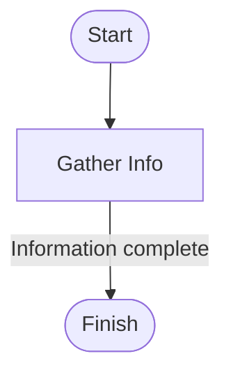

# Agent Design

Nomos encourages a **step-based** approach where each step defines its own
purpose and allowed tools. Steps are organised into flows so you can manage
conversation context and transitions explicitly.

## Steps

Every step has an ID, a description for the LLM and a list of tools that can be
used. You may define routes to jump to another step when conditions are met.

```yaml
- step_id: gather_info
  description: Collect user data
  available_tools:
    - ask_database
  routes:
    - target: finish
      condition: Information complete
```

### Visualising a Simple Flow



## Flows

Flows group related steps and can carry dedicated memory components. When
switching flows, Nomos summarises and transfers context automatically.

Benefits of flows:

1. **Scoped memory** – each flow keeps only relevant information.
2. **Structured transitions** – define where a flow starts and ends.
3. **Scalable design** – add new flows without changing existing ones.

This structured design improves reliability and observability while letting you
test each piece independently.
