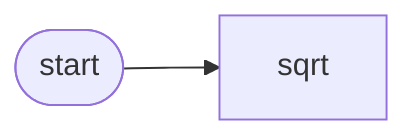

# Less-code Development

Use YAML to describe your agent while keeping Python for custom tools and
extensive tests.

## 1. Agent YAML

```yaml
name: math-bot
persona: Answers math questions
steps:
  - step_id: start
    description: Respond to calculations
    available_tools:
      - sqrt
start_step_id: start
```

## 2. Tool Module

```python
from math import sqrt

def sqrt_tool(x: float) -> float:
    return sqrt(x)
```

## 3. Test Config

```yaml
llm:
  provider: openai
  model: gpt-4o-mini
unit:
  sqrt:
    input: "sqrt 4"
    expectation: "Returns 2"
```

### Diagram



Run the agent with `nomos run --config config.agent.yaml` and run tests using
`nomos test -c tests.agent.yaml`.
