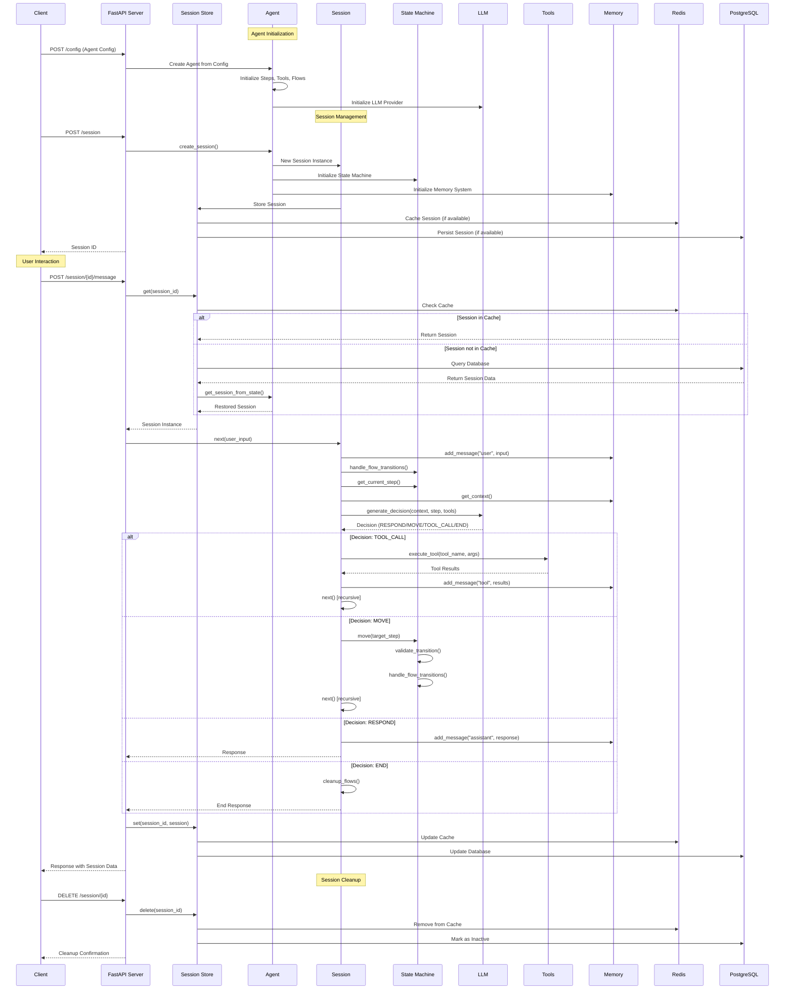
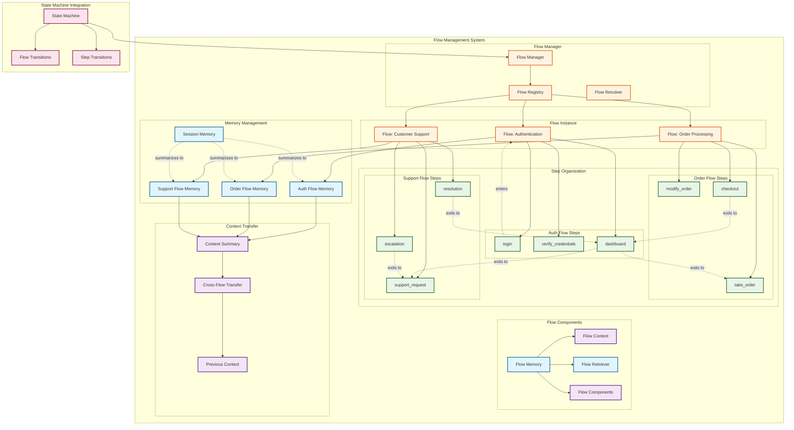
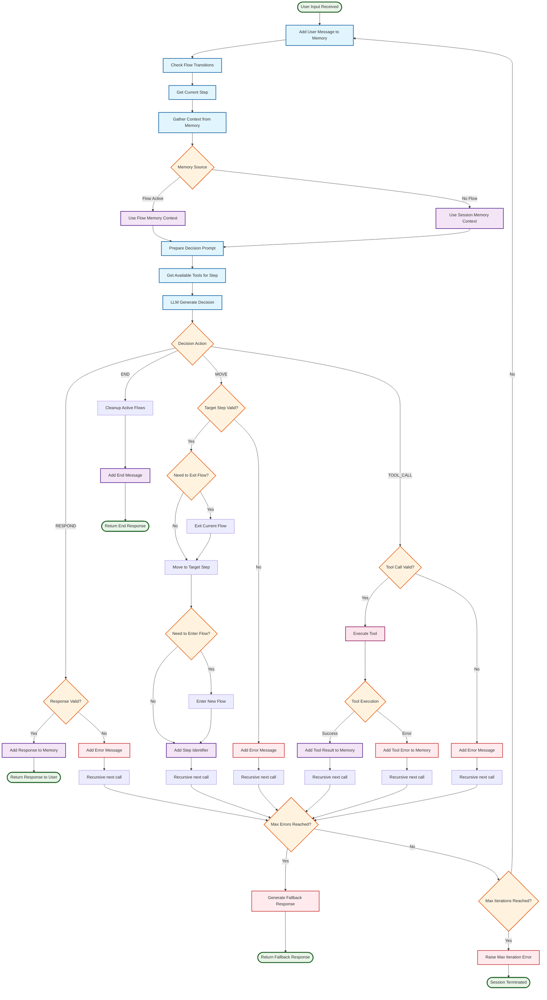

NOMOS is a sophisticated multi-step agent framework that combines the intelligence of Large Language Models with the reliability and predictability of state machines. This document provides comprehensive architecture diagrams that illustrate the system's design and component interactions.

<Danger>Do not get scared by the complexity of the architecture diagrams. They are designed to provide a clear understanding of how NOMOS operates at a low level, and each component plays a crucial role in the overall functionality of the framework.</Danger>

## System Overview

The following diagram shows the high-level architecture of NOMOS, including its core components and their relationships:

```mermaid
graph TB
    subgraph "NOMOS Framework"
        subgraph "Core Components"
            Agent[Agent]
            Session[Session]
            StateMachine[State Machine]
            Memory[Memory System]
        end

        subgraph "Configuration Layer"
            AgentConfig[Agent Config]
            StepConfig[Step Config]
            FlowConfig[Flow Config]
            ToolConfig[Tool Config]
            LLMConfig[LLM Config]
        end

        subgraph "Step System"
            Step1[Step 1]
            Step2[Step 2]
            StepN[Step N]
            Routes[Route Transitions]
        end

        subgraph "Flow Management"
            FlowManager[Flow Manager]
            FlowContext[Flow Context]
            FlowMemory[Flow Memory]
            FlowComponents[Flow Components]
        end

        subgraph "Tool System"
            ToolRegistry[Tool Registry]
            ExternalTools[External Tools]
            CustomTools[Custom Tools]
            ToolWrapper[Tool Wrapper]
        end

        subgraph "LLM Integration"
            LLMBase[LLM Base]
            OpenAI[OpenAI]
            Anthropic[Anthropic]
            Google[Google]
            Ollama[Ollama]
            HuggingFace[HuggingFace]
        end
    end

    subgraph "API Layer"
        FastAPI[FastAPI Server]
        WebSocket[WebSocket]
        REST[REST Endpoints]
    end

    subgraph "Persistence Layer"
        Redis[Redis Cache]
        PostgreSQL[PostgreSQL]
        SessionStore[Session Store]
    end

    subgraph "Client Applications"
        CLI[CLI Interface]
        WebUI[Web UI]
        TypeScript[TypeScript SDK]
        Playground[Visual Playground]
    end

    subgraph "External Integrations"
        CrewAI[CrewAI Tools]
        LangChain[LangChain Tools]
        PythonPkg[Python Packages]
    end

    %% Connections
    Agent --> Session
    Agent --> AgentConfig
    Session --> StateMachine
    Session --> Memory
    StateMachine --> Step1
    StateMachine --> Step2
    StateMachine --> StepN
    StateMachine --> FlowManager

    FlowManager --> FlowContext
    FlowManager --> FlowMemory
    FlowManager --> FlowComponents

    Step1 --> Routes
    Step2 --> Routes
    StepN --> Routes

    Session --> ToolRegistry
    ToolRegistry --> ExternalTools
    ToolRegistry --> CustomTools
    ToolRegistry --> ToolWrapper

    Session --> LLMBase
    LLMBase --> OpenAI
    LLMBase --> Anthropic
    LLMBase --> Google
    LLMBase --> Ollama
    LLMBase --> HuggingFace

    Agent --> FastAPI
    FastAPI --> WebSocket
    FastAPI --> REST
    FastAPI --> SessionStore

    SessionStore --> Redis
    SessionStore --> PostgreSQL

    FastAPI --> CLI
    FastAPI --> WebUI
    FastAPI --> TypeScript
    FastAPI --> Playground

    ExternalTools --> CrewAI
    ExternalTools --> LangChain
    ExternalTools --> PythonPkg

    %% Styling
    classDef coreClass fill:#e1f5fe,stroke:#01579b,stroke-width:2px
    classDef configClass fill:#f3e5f5,stroke:#4a148c,stroke-width:2px
    classDef stepClass fill:#e8f5e8,stroke:#1b5e20,stroke-width:2px
    classDef flowClass fill:#fff3e0,stroke:#e65100,stroke-width:2px
    classDef toolClass fill:#fce4ec,stroke:#880e4f,stroke-width:2px
    classDef llmClass fill:#e0f2f1,stroke:#004d40,stroke-width:2px
    classDef apiClass fill:#f1f8e9,stroke:#33691e,stroke-width:2px
    classDef persistClass fill:#fff8e1,stroke:#ff6f00,stroke-width:2px
    classDef clientClass fill:#e8eaf6,stroke:#1a237e,stroke-width:2px
    classDef externalClass fill:#efebe9,stroke:#3e2723,stroke-width:2px

    class Agent,Session,StateMachine,Memory coreClass
    class AgentConfig,StepConfig,FlowConfig,ToolConfig,LLMConfig configClass
    class Step1,Step2,StepN,Routes stepClass
    class FlowManager,FlowContext,FlowMemory,FlowComponents flowClass
    class ToolRegistry,ExternalTools,CustomTools,ToolWrapper toolClass
    class LLMBase,OpenAI,Anthropic,Google,Ollama,HuggingFace llmClass
    class FastAPI,WebSocket,REST apiClass
    class Redis,PostgreSQL,SessionStore persistClass
    class CLI,WebUI,TypeScript,Playground clientClass
    class CrewAI,LangChain,PythonPkg externalClass
```

## Agent Lifecycle and Session Management

This diagram illustrates how agents are created, sessions are managed, and how the system handles user interactions:

## Flow Management Architecture

This diagram shows how flows organize steps and manage context transitions:

## Decision Making and Tool Execution

This diagram illustrates how the LLM makes decisions and executes tools within the step-based architecture:

## API and Client Architecture

This diagram shows the API layer and how different clients interact with the system:

```mermaid
graph TB
    subgraph "Client Layer"
        CLI[CLI Interface]
        WebUI[Web UI]
        Playground[Visual Playground]
        SDK[TypeScript SDK]
        Custom[Custom Applications]
    end

    subgraph "API Gateway"
        FastAPI[FastAPI Server]
        CORS[CORS Middleware]
        Auth[Authentication]
        RateLimit[Rate Limiting]
    end

    subgraph "API Endpoints"
        subgraph "REST API"
            SessionCreate[POST /session]
            SessionMessage[POST /session/id/message]
            SessionHistory[GET /session/id/history]
            SessionDelete[DELETE /session/id]
            ConfigEndpoint[GET /config]
            ChatEndpoint[POST /chat]
        end

        subgraph "WebSocket API"
            WSChat[WebSocket /ws/chat]
            WSSession[WebSocket /ws/session/id]
        end

        subgraph "Static Assets"
            StaticFiles[Static File Server]
            WebInterface[Web Interface HTML/JS]
        end
    end

    subgraph "Business Logic"
        subgraph "Agent Management"
            AgentFactory[Agent Factory]
            ConfigValidator[Config Validator]
            AgentInstance[Agent Instance]
        end

        subgraph "Session Management"
            SessionController[Session Controller]
            SessionValidator[Session Validator]
            StateManager[State Manager]
        end
    end

    subgraph "Persistence Layer"
        subgraph "Session Storage"
            SessionStore[Session Store]
            InMemoryStore[In-Memory Store]
        end

        subgraph "Caching"
            RedisCache[Redis Cache]
            TTLManagement[TTL Management]
        end

        subgraph "Database"
            PostgresDB[PostgreSQL]
            SessionTable[Session Table]
            MetricsTable[Metrics Table]
        end
    end

    subgraph "Monitoring & Observability"
        Logging[Structured Logging]
        Metrics[Performance Metrics]
        Tracing[OpenTelemetry Tracing]
        HealthCheck[Health Checks]
    end

    %% Client Connections
    CLI --> FastAPI
    WebUI --> FastAPI
    Playground --> FastAPI
    SDK --> FastAPI
    Custom --> FastAPI

    %% API Gateway
    FastAPI --> CORS
    FastAPI --> Auth
    FastAPI --> RateLimit

    %% Endpoint Routing
    FastAPI --> SessionCreate
    FastAPI --> SessionMessage
    FastAPI --> SessionHistory
    FastAPI --> SessionDelete
    FastAPI --> ConfigEndpoint
    FastAPI --> ChatEndpoint
    FastAPI --> WSChat
    FastAPI --> WSSession
    FastAPI --> StaticFiles
    FastAPI --> WebInterface

    %% Business Logic Integration
    SessionCreate --> SessionController
    SessionMessage --> SessionController
    SessionHistory --> SessionController
    SessionDelete --> SessionController
    ConfigEndpoint --> AgentFactory
    ChatEndpoint --> SessionController
    WSChat --> SessionController
    WSSession --> SessionController

    SessionController --> SessionValidator
    SessionController --> StateManager
    AgentFactory --> ConfigValidator
    AgentFactory --> AgentInstance

    %% Persistence Integration
    SessionController --> SessionStore
    SessionStore --> InMemoryStore
    SessionStore --> RedisCache
    SessionStore --> PostgresDB

    RedisCache --> TTLManagement
    PostgresDB --> SessionTable
    PostgresDB --> MetricsTable

    %% Monitoring Integration
    FastAPI --> Logging
    FastAPI --> Metrics
    FastAPI --> Tracing
    FastAPI --> HealthCheck

    SessionController --> Logging
    SessionController --> Metrics
    SessionController --> Tracing

    %% Styling
    classDef clientClass fill:#e8eaf6,stroke:#1a237e,stroke-width:2px
    classDef apiClass fill:#f1f8e9,stroke:#33691e,stroke-width:2px
    classDef endpointClass fill:#e0f2f1,stroke:#004d40,stroke-width:2px
    classDef businessClass fill:#fff3e0,stroke:#e65100,stroke-width:2px
    classDef persistClass fill:#fff8e1,stroke:#ff6f00,stroke-width:2px
    classDef monitorClass fill:#fce4ec,stroke:#880e4f,stroke-width:2px

    class CLI,WebUI,Playground,SDK,Custom clientClass
    class FastAPI,CORS,Auth,RateLimit apiClass
    class SessionCreate,SessionMessage,SessionHistory,SessionDelete,ConfigEndpoint,ChatEndpoint,WSChat,WSSession,StaticFiles,WebInterface endpointClass
    class AgentFactory,ConfigValidator,AgentInstance,SessionController,SessionValidator,StateManager businessClass
    class SessionStore,InMemoryStore,RedisCache,TTLManagement,PostgresDB,SessionTable,MetricsTable persistClass
    class Logging,Metrics,Tracing,HealthCheck monitorClass
```

## Memory and Context Management

This diagram illustrates how NOMOS manages different types of memory and context across sessions and flows:

```mermaid
graph TB
    subgraph "Memory Architecture"
        subgraph "Session Level"
            SessionMemory[Session Memory]
            SessionContext[Session Context]
            SessionRetriever[Session Retriever]
        end

        subgraph "Flow Level"
            FlowMemory1[Flow Memory 1]
            FlowMemory2[Flow Memory 2]
            FlowMemoryN[Flow Memory N]
            FlowContext1[Flow Context 1]
            FlowContext2[Flow Context 2]
            FlowContextN[Flow Context N]
        end

        subgraph "Memory Components"
            subgraph "Retrieval Systems"
                BM25Retriever[BM25 Retriever]
                EmbeddingRetriever[Embedding Retriever]
                HybridRetriever[Hybrid Retriever]
            end

            subgraph "Memory Types"
                Messages[Message History]
                StepIdentifiers[Step Identifiers]
                Summaries[Context Summaries]
                ToolResults[Tool Results]
            end

            subgraph "LLM Integration"
                EmbeddingModel[Embedding Model]
                SummarizationLLM[Summarization LLM]
                ContextLLM[Context LLM]
            end
        end

        subgraph "Context Operations"
            ContextAdd[Add to Context]
            ContextSearch[Search Context]
            ContextSummarize[Summarize Context]
            ContextTransfer[Transfer Context]
        end
    end

    subgraph "Memory Flow Control"
        MemoryRouter{Active Flow?}
        FlowMemoryActive[Flow Memory Active]
        SessionMemoryActive[Session Memory Active]

        FlowEnter[Flow Enter]
        FlowExit[Flow Exit]
        FlowCleanup[Flow Cleanup]

        CrossFlowTransfer[Cross-Flow Transfer]
        ContextSummary[Context Summary Generation]
        PreviousContext[Previous Context Integration]
    end

    subgraph "Persistence Integration"
        MemoryPersistence[Memory Persistence]
        StateRestore[State Restoration]
        ContextRestore[Context Restoration]
    end

    %% Memory Hierarchy
    SessionMemory --> SessionContext
    SessionMemory --> SessionRetriever

    FlowMemory1 --> FlowContext1
    FlowMemory2 --> FlowContext2
    FlowMemoryN --> FlowContextN

    %% Retrieval Systems
    SessionRetriever --> BM25Retriever
    SessionRetriever --> EmbeddingRetriever
    SessionRetriever --> HybridRetriever

    FlowMemory1 --> BM25Retriever
    FlowMemory2 --> EmbeddingRetriever
    FlowMemoryN --> HybridRetriever

    %% Memory Content Types
    SessionContext --> Messages
    SessionContext --> StepIdentifiers
    SessionContext --> Summaries
    SessionContext --> ToolResults

    FlowContext1 --> Messages
    FlowContext1 --> StepIdentifiers
    FlowContext1 --> Summaries
    FlowContext1 --> ToolResults

    %% LLM Integration
    EmbeddingRetriever --> EmbeddingModel
    ContextSummary --> SummarizationLLM
    CrossFlowTransfer --> ContextLLM

    %% Context Operations
    SessionMemory --> ContextAdd
    FlowMemory1 --> ContextAdd
    FlowMemory2 --> ContextAdd

    SessionMemory --> ContextSearch
    FlowMemory1 --> ContextSearch
    FlowMemory2 --> ContextSearch

    %% Memory Flow Control
    ContextAdd --> MemoryRouter
    MemoryRouter -->|Yes| FlowMemoryActive
    MemoryRouter -->|No| SessionMemoryActive

    FlowMemoryActive --> FlowMemory1
    FlowMemoryActive --> FlowMemory2
    SessionMemoryActive --> SessionMemory

    %% Flow Lifecycle
    FlowEnter --> PreviousContext
    PreviousContext --> FlowMemory1
    PreviousContext --> FlowMemory2

    FlowExit --> ContextSummary
    ContextSummary --> CrossFlowTransfer
    CrossFlowTransfer --> SessionMemory

    FlowCleanup --> FlowMemory1
    FlowCleanup --> FlowMemory2

    %% Persistence
    SessionMemory --> MemoryPersistence
    FlowMemory1 --> MemoryPersistence
    FlowMemory2 --> MemoryPersistence

    MemoryPersistence --> StateRestore
    StateRestore --> ContextRestore
    ContextRestore --> SessionMemory
    ContextRestore --> FlowMemory1

    %% Styling
    classDef sessionClass fill:#e1f5fe,stroke:#01579b,stroke-width:2px
    classDef flowClass fill:#fff3e0,stroke:#e65100,stroke-width:2px
    classDef retrievalClass fill:#e8f5e8,stroke:#1b5e20,stroke-width:2px
    classDef contentClass fill:#f3e5f5,stroke:#4a148c,stroke-width:2px
    classDef llmClass fill:#e0f2f1,stroke:#004d40,stroke-width:2px
    classDef operationClass fill:#fce4ec,stroke:#880e4f,stroke-width:2px
    classDef controlClass fill:#fff8e1,stroke:#ff6f00,stroke-width:2px
    classDef persistClass fill:#efebe9,stroke:#3e2723,stroke-width:2px

    class SessionMemory,SessionContext,SessionRetriever,SessionMemoryActive sessionClass
    class FlowMemory1,FlowMemory2,FlowMemoryN,FlowContext1,FlowContext2,FlowContextN,FlowMemoryActive flowClass
    class BM25Retriever,EmbeddingRetriever,HybridRetriever retrievalClass
    class Messages,StepIdentifiers,Summaries,ToolResults contentClass
    class EmbeddingModel,SummarizationLLM,ContextLLM llmClass
    class ContextAdd,ContextSearch,ContextSummarize,ContextTransfer operationClass
    class MemoryRouter,FlowEnter,FlowExit,FlowCleanup,CrossFlowTransfer,ContextSummary,PreviousContext controlClass
    class MemoryPersistence,StateRestore,ContextRestore persistClass
```

## Tool System Architecture

This diagram shows how NOMOS integrates and manages different types of tools:

```mermaid
graph TB
    subgraph "Tool System Architecture"
        subgraph "Tool Registry"
            ToolRegistry[Tool Registry]
            ToolResolver[Tool Resolver]
            ToolValidator[Tool Validator]
            ToolCache[Tool Cache]
        end

        subgraph "Tool Types"
            subgraph "Custom Tools"
                PythonFunctions[Python Functions]
                CustomClasses[Custom Classes]
                LocalModules[Local Modules]
            end

            subgraph "External Tools"
                CrewAITools[CrewAI Tools]
                LangChainTools[LangChain Tools]
                PackageTools[Package Tools]
            end

            subgraph "Built-in Tools"
                SystemTools[System Tools]
                UtilityTools[Utility Tools]
                ValidationTools[Validation Tools]
            end
        end

        subgraph "Tool Wrappers"
            ToolWrapper[Tool Wrapper]
            AsyncWrapper[Async Wrapper]
            ErrorWrapper[Error Wrapper]
            ValidationWrapper[Validation Wrapper]
        end

        subgraph "Tool Configuration"
            ToolConfig[Tool Config]
            ToolDefinition[Tool Definition]
            ArgDefinition[Argument Definition]
            ExternalToolConfig[External Tool Config]
        end

        subgraph "Tool Execution"
            ToolExecutor[Tool Executor]
            ArgumentParser[Argument Parser]
            ResultProcessor[Result Processor]
            ErrorHandler[Error Handler]
        end

        subgraph "Tool Discovery"
            ModuleScanner[Module Scanner]
            FunctionExtractor[Function Extractor]
            DocstringParser[Docstring Parser]
            TypeInspector[Type Inspector]
        end
    end

    subgraph "Integration Layer"
        subgraph "Step Integration"
            StepToolManager[Step Tool Manager]
            ToolAvailability[Tool Availability]
            ContextualAccess[Contextual Access]
        end

        subgraph "LLM Integration"
            ToolSchema[Tool Schema Generator]
            ToolPrompt[Tool Prompt Builder]
            ToolSelection[Tool Selection Logic]
        end

        subgraph "Security Layer"
            ToolSandbox[Tool Sandbox]
            PermissionManager[Permission Manager]
            ResourceLimiter[Resource Limiter]
        end
    end

    subgraph "External Integrations"
        subgraph "CrewAI Integration"
            CrewAIAdapter[CrewAI Adapter]
            CrewAIRegistry[CrewAI Tool Registry]
        end

        subgraph "LangChain Integration"
            LangChainAdapter[LangChain Adapter]
            LangChainRegistry[LangChain Tool Registry]
        end

        subgraph "Package Integration"
            PackageLoader[Package Loader]
            DynamicImporter[Dynamic Importer]
            PackageValidator[Package Validator]
        end
    end

    %% Tool Registry Flow
    ToolRegistry --> ToolResolver
    ToolRegistry --> ToolValidator
    ToolRegistry --> ToolCache

    %% Tool Types Registration
    PythonFunctions --> ToolRegistry
    CustomClasses --> ToolRegistry
    LocalModules --> ToolRegistry
    CrewAITools --> ToolRegistry
    LangChainTools --> ToolRegistry
    PackageTools --> ToolRegistry
    SystemTools --> ToolRegistry
    UtilityTools --> ToolRegistry
    ValidationTools --> ToolRegistry

    %% Tool Wrapping
    ToolRegistry --> ToolWrapper
    ToolWrapper --> AsyncWrapper
    ToolWrapper --> ErrorWrapper
    ToolWrapper --> ValidationWrapper

    %% Configuration
    ToolConfig --> ToolDefinition
    ToolConfig --> ArgDefinition
    ToolConfig --> ExternalToolConfig
    ToolDefinition --> ToolRegistry

    %% Tool Execution Flow
    ToolWrapper --> ToolExecutor
    ToolExecutor --> ArgumentParser
    ToolExecutor --> ResultProcessor
    ToolExecutor --> ErrorHandler

    %% Tool Discovery
    ModuleScanner --> FunctionExtractor
    FunctionExtractor --> DocstringParser
    DocstringParser --> TypeInspector
    TypeInspector --> ToolDefinition

    %% Step Integration
    ToolRegistry --> StepToolManager
    StepToolManager --> ToolAvailability
    StepToolManager --> ContextualAccess

    %% LLM Integration
    ToolDefinition --> ToolSchema
    ToolSchema --> ToolPrompt
    ToolPrompt --> ToolSelection

    %% Security
    ToolExecutor --> ToolSandbox
    ToolSandbox --> PermissionManager
    ToolSandbox --> ResourceLimiter

    %% External Integrations
    CrewAITools --> CrewAIAdapter
    CrewAIAdapter --> CrewAIRegistry
    CrewAIRegistry --> ToolRegistry

    LangChainTools --> LangChainAdapter
    LangChainAdapter --> LangChainRegistry
    LangChainRegistry --> ToolRegistry

    PackageTools --> PackageLoader
    PackageLoader --> DynamicImporter
    DynamicImporter --> PackageValidator
    PackageValidator --> ToolRegistry

    %% Styling
    classDef registryClass fill:#e1f5fe,stroke:#01579b,stroke-width:2px
    classDef toolClass fill:#e8f5e8,stroke:#1b5e20,stroke-width:2px
    classDef wrapperClass fill:#fff3e0,stroke:#e65100,stroke-width:2px
    classDef configClass fill:#f3e5f5,stroke:#4a148c,stroke-width:2px
    classDef executionClass fill:#fce4ec,stroke:#880e4f,stroke-width:2px
    classDef discoveryClass fill:#e0f2f1,stroke:#004d40,stroke-width:2px
    classDef integrationClass fill:#f1f8e9,stroke:#33691e,stroke-width:2px
    classDef securityClass fill:#ffebee,stroke:#c62828,stroke-width:2px
    classDef externalClass fill:#efebe9,stroke:#3e2723,stroke-width:2px

    class ToolRegistry,ToolResolver,ToolValidator,ToolCache registryClass
    class PythonFunctions,CustomClasses,LocalModules,CrewAITools,LangChainTools,PackageTools,SystemTools,UtilityTools,ValidationTools toolClass
    class ToolWrapper,AsyncWrapper,ErrorWrapper,ValidationWrapper wrapperClass
    class ToolConfig,ToolDefinition,ArgDefinition,ExternalToolConfig configClass
    class ToolExecutor,ArgumentParser,ResultProcessor,ErrorHandler executionClass
    class ModuleScanner,FunctionExtractor,DocstringParser,TypeInspector discoveryClass
    class StepToolManager,ToolAvailability,ContextualAccess,ToolSchema,ToolPrompt,ToolSelection integrationClass
    class ToolSandbox,PermissionManager,ResourceLimiter securityClass
    class CrewAIAdapter,CrewAIRegistry,LangChainAdapter,LangChainRegistry,PackageLoader,DynamicImporter,PackageValidator externalClass
```

## Development and Deployment Architecture

This final diagram shows the development workflow and deployment options for NOMOS agents:

```mermaid
graph TB
    subgraph "Development Workflow"
        subgraph "Design Phase"
            Playground[Visual Playground]
            FlowDesigner[Flow Designer]
            DragDrop[Drag & Drop Interface]
        end

        subgraph "Configuration Phase"
            YAMLConfig[YAML Configuration]
            PythonAPI[Python API]
            ConfigValidator[Config Validator]
        end

        subgraph "Development Phase"
            CLI[CLI Development]
            LocalTesting[Local Testing]
            UnitTests[Unit Tests]
            IntegrationTests[Integration Tests]
        end

        subgraph "Testing & Validation"
            TestRunner[Test Runner]
            Benchmarks[Performance Benchmarks]
            QualityAssurance[Quality Assurance]
        end
    end

    subgraph "Deployment Options"
        subgraph "Local Deployment"
            LocalAgent[Local Agent]
            LocalServer[Local Server]
            DevelopmentMode[Development Mode]
        end

        subgraph "Container Deployment"
            DockerImage[Docker Image]
            DockerCompose[Docker Compose]
            Kubernetes[Kubernetes]
        end

        subgraph "Cloud Deployment"
            CloudRun[Google Cloud Run]
            AWSLambda[AWS Lambda]
            AzureContainer[Azure Container]
            DigitalOcean[DigitalOcean Apps]
        end

        subgraph "Production Infrastructure"
            LoadBalancer[Load Balancer]
            AutoScaling[Auto Scaling]
            MonitoringStack[Monitoring Stack]
        end
    end

    subgraph "Runtime Environment"
        subgraph "Core Runtime"
            PythonRuntime[Python Runtime]
            FastAPIServer[FastAPI Server]
            UvicornServer[Uvicorn Server]
        end

        subgraph "Dependencies"
            LLMProviders[LLM Providers]
            DatabaseConnections[Database Connections]
            ExternalAPIs[External APIs]
        end

        subgraph "Configuration Management"
            EnvironmentVars[Environment Variables]
            ConfigFiles[Configuration Files]
            SecretsManager[Secrets Manager]
        end
    end

    subgraph "Monitoring & Operations"
        subgraph "Observability"
            StructuredLogging[Structured Logging]
            MetricsCollection[Metrics Collection]
            DistributedTracing[Distributed Tracing]
        end

        subgraph "Performance Monitoring"
            APMTracing[APM Tracing]
            ResponseMetrics[Response Metrics]
            ResourceMonitoring[Resource Monitoring]
        end

        subgraph "Alerting & Health"
            HealthChecks[Health Checks]
            AlertManager[Alert Manager]
            UptimeMonitoring[Uptime Monitoring]
        end
    end

    subgraph "Client Integration"
        subgraph "Frontend Clients"
            ReactApp[React Applications]
            VueApp[Vue Applications]
            WebComponents[Web Components]
        end

        subgraph "Backend Integration"
            APIClients[API Clients]
            SDKs[Language SDKs]
            Webhooks[Webhook Integration]
        end

        subgraph "Mobile & Desktop"
            MobileApps[Mobile Apps]
            DesktopApps[Desktop Apps]
            CLITools[CLI Tools]
        end
    end

    %% Development Flow
    Playground --> YAMLConfig
    FlowDesigner --> YAMLConfig
    DragDrop --> YAMLConfig

    YAMLConfig --> ConfigValidator
    PythonAPI --> ConfigValidator
    ConfigValidator --> CLI

    CLI --> LocalTesting
    LocalTesting --> UnitTests
    UnitTests --> IntegrationTests
    IntegrationTests --> TestRunner

    TestRunner --> Benchmarks
    Benchmarks --> QualityAssurance

    %% Deployment Flow
    QualityAssurance --> LocalAgent
    QualityAssurance --> DockerImage
    QualityAssurance --> CloudRun

    LocalAgent --> LocalServer
    LocalServer --> DevelopmentMode

    DockerImage --> DockerCompose
    DockerImage --> Kubernetes
    DockerImage --> CloudRun
    DockerImage --> AWSLambda
    DockerImage --> AzureContainer
    DockerImage --> DigitalOcean

    Kubernetes --> LoadBalancer
    CloudRun --> LoadBalancer
    LoadBalancer --> AutoScaling
    AutoScaling --> MonitoringStack

    %% Runtime Environment
    LocalServer --> PythonRuntime
    DockerImage --> PythonRuntime
    PythonRuntime --> FastAPIServer
    FastAPIServer --> UvicornServer

    UvicornServer --> LLMProviders
    UvicornServer --> DatabaseConnections
    UvicornServer --> ExternalAPIs

    PythonRuntime --> EnvironmentVars
    PythonRuntime --> ConfigFiles
    PythonRuntime --> SecretsManager

    %% Monitoring Integration
    UvicornServer --> StructuredLogging
    UvicornServer --> MetricsCollection
    UvicornServer --> DistributedTracing

    MetricsCollection --> APMTracing
    MetricsCollection --> ResponseMetrics
    MetricsCollection --> ResourceMonitoring

    DistributedTracing --> HealthChecks
    HealthChecks --> AlertManager
    AlertManager --> UptimeMonitoring

    %% Client Integration
    UvicornServer --> ReactApp
    UvicornServer --> VueApp
    UvicornServer --> WebComponents

    UvicornServer --> APIClients
    UvicornServer --> SDKs
    UvicornServer --> Webhooks

    APIClients --> MobileApps
    SDKs --> DesktopApps
    CLI --> CLITools

    %% Styling
    classDef developmentClass fill:#e8f5e8,stroke:#1b5e20,stroke-width:2px
    classDef deploymentClass fill:#e1f5fe,stroke:#01579b,stroke-width:2px
    classDef runtimeClass fill:#fff3e0,stroke:#e65100,stroke-width:2px
    classDef monitoringClass fill:#fce4ec,stroke:#880e4f,stroke-width:2px
    classDef clientClass fill:#f3e5f5,stroke:#4a148c,stroke-width:2px
    classDef infraClass fill:#e0f2f1,stroke:#004d40,stroke-width:2px

    class Playground,FlowDesigner,DragDrop,YAMLConfig,PythonAPI,ConfigValidator,CLI,LocalTesting,UnitTests,IntegrationTests,TestRunner,Benchmarks,QualityAssurance developmentClass
    class LocalAgent,LocalServer,DevelopmentMode,DockerImage,DockerCompose,Kubernetes,CloudRun,AWSLambda,AzureContainer,DigitalOcean deploymentClass
    class PythonRuntime,FastAPIServer,UvicornServer,LLMProviders,DatabaseConnections,ExternalAPIs,EnvironmentVars,ConfigFiles,SecretsManager runtimeClass
    class StructuredLogging,MetricsCollection,DistributedTracing,APMTracing,ResponseMetrics,ResourceMonitoring,HealthChecks,AlertManager,UptimeMonitoring monitoringClass
    class ReactApp,VueApp,WebComponents,APIClients,SDKs,Webhooks,MobileApps,DesktopApps,CLITools clientClass
    class LoadBalancer,AutoScaling,MonitoringStack infraClass
```

## Summary

The NOMOS architecture is designed around several key principles:

1. **Modular Design**: Each component has a specific responsibility and can be tested independently
2. **State Machine Reliability**: Agent behavior is predictable and auditable through step-based transitions
3. **Flow Organization**: Related steps are grouped into flows with shared context and components
4. **Memory Hierarchy**: Different levels of memory management for sessions, flows, and context transfer
5. **Tool Integration**: Unified interface for custom, external, and package-based tools
6. **API-First Design**: RESTful and WebSocket APIs enable diverse client integrations
7. **Production Ready**: Built-in persistence, monitoring, and scaling capabilities

This architecture enables NOMOS to bridge the gap between rapid prototyping and production-ready AI agent deployment while maintaining the testability and reliability expected in enterprise software systems.
