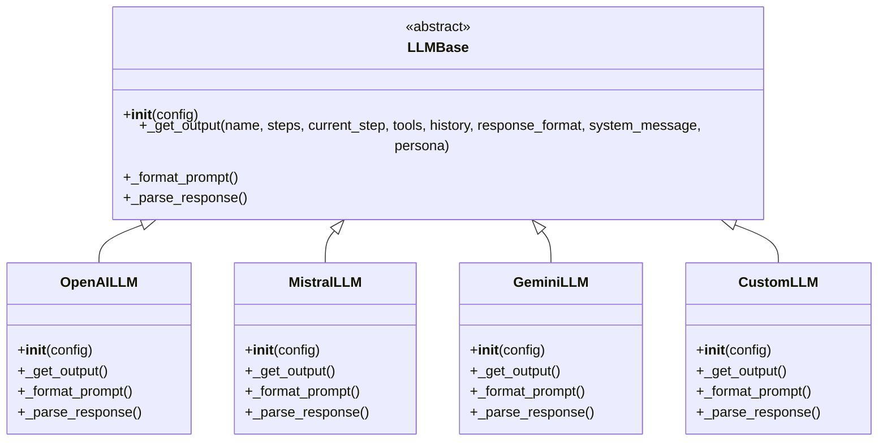

# LLM Providers

SOFIA supports multiple Large Language Model (LLM) providers through a flexible provider architecture. This page documents the available LLM providers, their configuration options, and usage examples.

## Provider Architecture

SOFIA's LLM integration follows a provider pattern:

<div className="flex justify-center my-8">

</div>

The factory pattern selects and instantiates the appropriate LLM provider:

```python
from sofia.llms.factory import LLMFactory

# Create an LLM provider
llm = LLMFactory.create(
    provider="openai",
    config={
        "model": "gpt-4",
        "api_key": "your-api-key"
    }
)
```

## Common Configuration Parameters

All LLM providers support these common parameters:

| Parameter | Type | Description | Default |
|-----------|------|-------------|---------|
| `api_key` | `str` | Authentication key for the API | Required |
| `model` | `str` | Model name to use | Varies by provider |
| `temperature` | `float` | Controls response randomness (0.0 to 1.0) | `0.7` |
| `max_tokens` | `int` | Maximum tokens in generated responses | `1000` |
| `timeout` | `int` | Request timeout in seconds | `30` |
| `retry_count` | `int` | Number of retry attempts for failed requests | `3` |
| `retry_delay` | `float` | Delay between retry attempts in seconds | `1.0` |
| `api_type` | `str` | API type (azure, openai, etc.) | `None` |
| `api_base` | `str` | Base URL for API requests | Provider default |

## OpenAI Provider

The OpenAI provider integrates with OpenAI's models like GPT-4 and GPT-3.5.

### Configuration

```python
from sofia import Sofia

sofia = Sofia(
    name="openai_agent",
    llm_provider="openai",
    llm_config={
        "model": "gpt-4",  # or "gpt-3.5-turbo"
        "api_key": "your-openai-api-key",
        "temperature": 0.7,
        "max_tokens": 1000,
        "top_p": 1.0,
        "frequency_penalty": 0.0,
        "presence_penalty": 0.0,
        "organization_id": "your-org-id",  # Optional
        "api_base": "https://api.openai.com/v1",  # Optional
        "api_type": "openai",  # or "azure"
        "api_version": "2023-05-15"  # Required for Azure
    }
)
```

### Provider-Specific Parameters

| Parameter | Type | Description | Default |
|-----------|------|-------------|---------|
| `top_p` | `float` | Nucleus sampling parameter | `1.0` |
| `frequency_penalty` | `float` | Penalizes repeated tokens | `0.0` |
| `presence_penalty` | `float` | Penalizes repeated topics | `0.0` |
| `organization_id` | `str` | OpenAI organization ID | `None` |
| `api_version` | `str` | API version (required for Azure) | `None` |
| `seed` | `int` | Random seed for deterministic outputs | `None` |

### Supported Models

- `gpt-4`
- `gpt-4-turbo`
- `gpt-4-vision-preview`
- `gpt-3.5-turbo`
- `gpt-3.5-turbo-16k`

### Azure OpenAI

For Azure OpenAI, configure as follows:

```python
sofia = Sofia(
    name="azure_openai_agent",
    llm_provider="openai",
    llm_config={
        "api_type": "azure",
        "api_base": "https://your-resource-name.openai.azure.com",
        "api_key": "your-azure-openai-key",
        "api_version": "2023-07-01-preview",
        "deployment_name": "your-deployment-name",  # Maps to model
        "temperature": 0.7,
        "max_tokens": 1000
    }
)
```

## Mistral Provider

The Mistral provider integrates with Mistral AI's models.

### Configuration

```python
from sofia import Sofia

sofia = Sofia(
    name="mistral_agent",
    llm_provider="mistral",
    llm_config={
        "model": "mistral-large-latest",  # or other Mistral models
        "api_key": "your-mistral-api-key",
        "temperature": 0.7,
        "max_tokens": 1000,
        "top_p": 1.0,
        "safe_mode": True,  # Enable content filtering
        "random_seed": 42  # For deterministic outputs
    }
)
```

### Provider-Specific Parameters

| Parameter | Type | Description | Default |
|-----------|------|-------------|---------|
| `top_p` | `float` | Nucleus sampling parameter | `1.0` |
| `safe_mode` | `bool` | Enable content safety filtering | `False` |
| `random_seed` | `int` | Random seed for deterministic outputs | `None` |

### Supported Models

- `mistral-large-latest`
- `mistral-medium`
- `mistral-small-latest`
- `open-mistral-7b`
- `open-mixtral-8x7b`

## Gemini Provider

The Gemini provider integrates with Google's Gemini models.

### Configuration

```python
from sofia import Sofia

sofia = Sofia(
    name="gemini_agent",
    llm_provider="gemini",
    llm_config={
        "model": "gemini-pro",
        "api_key": "your-gemini-api-key",
        "temperature": 0.7,
        "max_tokens": 1000,
        "top_p": 0.95,
        "top_k": 40,
        "safety_settings": {
            "harassment": "block_medium_and_above",
            "hate_speech": "block_medium_and_above",
            "sexually_explicit": "block_medium_and_above",
            "dangerous_content": "block_medium_and_above"
        }
    }
)
```

### Provider-Specific Parameters

| Parameter | Type | Description | Default |
|-----------|------|-------------|---------|
| `top_p` | `float` | Nucleus sampling parameter | `0.95` |
| `top_k` | `int` | Top-k sampling parameter | `40` |
| `safety_settings` | `Dict[str, str]` | Content safety thresholds | `None` |

### Supported Models

- `gemini-pro`
- `gemini-pro-vision`

### Safety Settings

Available safety categories and thresholds:

```python
safety_settings = {
    # Categories
    "harassment": threshold,
    "hate_speech": threshold,
    "sexually_explicit": threshold,
    "dangerous_content": threshold,
    
    # Thresholds (from least to most restrictive)
    # "block_none" - No blocking
    # "block_only_high" - Block only high severity
    # "block_medium_and_above" - Block medium and high severity
    # "block_low_and_above" - Block all but negligible severity
    # "block_all" - Block everything
}
```

## Custom LLM Providers

### Creating a Custom Provider

To create a custom LLM provider, extend the `LLMBase` class:

```python
from sofia.llms.base import LLMBase
from typing import Dict, Any, List, Optional

class CustomLLM(LLMBase):
    def __init__(self, config: Dict[str, Any]):
        super().__init__(config)
        # Initialize your LLM client
        self.api_key = config.get("api_key")
        self.model = config.get("model", "default-model")
        self.client = YourLLMClient(self.api_key)  # Replace with actual client
    
    def _get_output(
        self,
        name: str,
        steps: List[Dict[str, Any]],
        current_step: str,
        tools: List[Dict[str, Any]],
        history: List[Dict[str, Any]],
        response_format: Dict[str, Any],
        system_message: Optional[str] = None,
        persona: Optional[str] = None
    ) -> Dict[str, Any]:
        """Get the next decision from the LLM.
        
        Args:
            name: Agent name
            steps: List of step definitions
            current_step: ID of the current step
            tools: List of available tools
            history: Conversation history
            response_format: Expected response format
            system_message: Optional system message
            persona: Optional persona description
            
        Returns:
            LLM response according to response_format
        """
        # Format the prompt for your LLM
        prompt = self._format_prompt(
            name=name,
            steps=steps,
            current_step=current_step,
            tools=tools,
            history=history,
            system_message=system_message,
            persona=persona
        )
        
        # Call your LLM
        response = self.client.generate(
            model=self.model,
            prompt=prompt,
            max_tokens=self.config.get("max_tokens", 1000),
            temperature=self.config.get("temperature", 0.7)
        )
        
        # Parse the response according to response_format
        parsed_response = self._parse_response(response, response_format)
        
        return parsed_response
```

### Registering a Custom Provider

Register your custom provider with SOFIA:

```python
from sofia.llms.factory import register_llm_provider

# Register the provider
register_llm_provider("custom_llm", CustomLLM)

# Use your custom LLM
sofia = Sofia(
    name="custom_llm_agent",
    llm_provider="custom_llm",
    llm_config={
        "api_key": "your-custom-api-key",
        "model": "your-model-name",
        "temperature": 0.5
    }
)
```

## Local LLM Integration

SOFIA can work with locally hosted LLMs:

### Ollama

```python
sofia = Sofia(
    name="ollama_agent",
    llm_provider="custom",
    llm_config={
        "api_base": "http://localhost:11434/api",
        "model": "llama2"
    }
)
```

### llama.cpp Server

```python
sofia = Sofia(
    name="llamacpp_agent",
    llm_provider="custom",
    llm_config={
        "api_base": "http://localhost:8080/v1",
        "model": "local-model"
    }
)
```

### LocalAI

```python
sofia = Sofia(
    name="localai_agent",
    llm_provider="custom",
    llm_config={
        "api_base": "http://localhost:8080/v1",
        "model": "gpt4all"
    }
)
```

## Response Formats

SOFIA uses structured response formats to ensure consistent outputs:

### Decision Format

```python
response_format = {
    "type": "json",
    "schema": {
        "type": "object",
        "properties": {
            "decision": {
                "type": "string",
                "enum": ["speak", "call_tool", "route"]
            },
            "message": {
                "type": "string"
            },
            "tool_name": {
                "type": "string"
            },
            "tool_args": {
                "type": "object"
            },
            "route": {
                "type": "string"
            },
            "reasoning": {
                "type": "string"
            }
        },
        "required": ["decision"]
    }
}
```

### Tool Call Format

```python
response_format = {
    "type": "json",
    "schema": {
        "type": "object",
        "properties": {
            "tool_name": {
                "type": "string"
            },
            "args": {
                "type": "object"
            }
        },
        "required": ["tool_name", "args"]
    }
}
```

## LLM Fallbacks

Configure fallback providers for resilience:

```python
sofia = Sofia(
    name="resilient_agent",
    llm_provider="openai",
    llm_config={
        "model": "gpt-4",
        "api_key": "your-openai-api-key",
        "fallback_providers": [
            {
                "provider": "mistral",
                "config": {
                    "model": "mistral-large-latest",
                    "api_key": "your-mistral-api-key"
                }
            },
            {
                "provider": "gemini",
                "config": {
                    "model": "gemini-pro",
                    "api_key": "your-gemini-api-key"
                }
            }
        ]
    }
)
```

## Token Usage Tracking

Track token usage and costs:

```python
from sofia import Sofia
from sofia.llms.policy import TokenUsagePolicy

# Create a token usage policy
token_policy = TokenUsagePolicy(
    max_tokens_per_session=10000,  # Maximum tokens per session
    max_tokens_per_day=100000,     # Maximum tokens per day
    max_cost_per_session=0.50,     # Maximum cost per session in USD
    max_cost_per_day=10.00         # Maximum cost per day in USD
)

sofia = Sofia(
    name="cost_managed_agent",
    llm_provider="openai",
    llm_config={
        "model": "gpt-4",
        "api_key": "your-openai-api-key"
    },
    token_usage_policy=token_policy
)
```

Access token usage statistics:

```python
# Get token usage for a session
usage = sofia.get_token_usage(session_id="session123")
print(f"Prompt tokens: {usage.prompt_tokens}")
print(f"Completion tokens: {usage.completion_tokens}")
print(f"Total tokens: {usage.total_tokens}")
print(f"Estimated cost: ${usage.estimated_cost:.4f}")

# Get overall token usage
total_usage = sofia.get_total_token_usage()
print(f"Total usage today: {total_usage.total_tokens} tokens")
print(f"Estimated cost today: ${total_usage.estimated_cost:.2f}")
```

## Prompt Templates

Customize the prompts sent to LLMs:

```python
sofia = Sofia(
    name="custom_prompt_agent",
    llm_provider="openai",
    llm_config={
        "model": "gpt-4",
        "api_key": "your-openai-api-key"
    },
    prompt_templates={
        "system": """You are {name}, a helpful assistant. {system_message}
        
The user's input is: {input}""",
        
        "tool_call": """Use the {tool_name} tool with these parameters:
{tool_params}""",
        
        "tool_result": """The tool returned the following result:
{result}""",
        
        "route_selection": """Based on the conversation, choose the most appropriate next step:

Current step: {current_step}
Available routes:
{routes}"""
    }
)
```

## Streaming Responses

Enable streaming responses for real-time results:

```python
from sofia import Sofia

sofia = Sofia(
    name="streaming_agent",
    llm_provider="openai",
    llm_config={
        "model": "gpt-4",
        "api_key": "your-openai-api-key",
        "streaming": True  # Enable streaming
    }
)

# Create a session
session = sofia.new_session()

# Define a callback for streamed chunks
def handle_chunk(chunk):
    print(chunk.content, end='', flush=True)

# Stream a response
response = session.send_message_stream(
    "Tell me about SOFIA",
    chunk_callback=handle_chunk
)
```

## Tokenization

Access the tokenizer for a specific LLM:

```python
from sofia.llms.factory import LLMFactory

# Get a tokenizer
tokenizer = LLMFactory.get_tokenizer(
    provider="openai",
    model="gpt-4"
)

# Count tokens in a string
text = "This is a sample text to count tokens."
token_count = tokenizer.count_tokens(text)
print(f"Token count: {token_count}")

# Encode text to tokens
tokens = tokenizer.encode(text)
print(f"Encoded tokens: {tokens}")

# Decode tokens to text
decoded_text = tokenizer.decode(tokens)
print(f"Decoded text: {decoded_text}")
```

## Response Caching

Enable response caching to reduce API calls:

```python
from sofia import Sofia
from sofia.llms.cache import ResponseCache

# Create a cache
response_cache = ResponseCache(
    cache_type="memory",  # or "redis"
    ttl=3600,  # Cache TTL in seconds
    max_size=1000  # Maximum cache entries
)

# Create a SOFIA agent with caching
sofia = Sofia(
    name="cached_agent",
    llm_provider="openai",
    llm_config={
        "model": "gpt-4",
        "api_key": "your-openai-api-key",
        "response_cache": response_cache
    }
)
```

For Redis caching:

```python
from sofia.llms.cache import ResponseCache

# Create a Redis cache
redis_cache = ResponseCache(
    cache_type="redis",
    redis_url="redis://localhost:6379/0",
    ttl=3600,
    prefix="sofia:cache:"
)
```

## Best Practices

1. **Choose the right model**: Match model capabilities to your agent's needs
2. **Set appropriate temperature**: Lower for factual tasks, higher for creative tasks
3. **Implement proper error handling**: Handle API failures gracefully
4. **Use streaming for responsive UIs**: Enable streaming for long responses
5. **Enable caching when possible**: Reduce costs and improve response times
6. **Configure fallbacks**: Ensure reliability with fallback providers
7. **Monitor token usage**: Track and manage costs
8. **Optimize prompts**: Clear, concise prompts reduce token usage

<Callout type="info">
  When working with multiple LLM providers, be aware of differences in their response formats, capabilities, and pricing models.
</Callout>

## Next Steps

- Learn about [Tool Development](/api/tool-development) to create tools for your agents
- Explore [Core API](/api/core-api) for detailed information about SOFIA's core APIs
- Visit [Server API](/api/server-api) to learn about SOFIA's HTTP API
