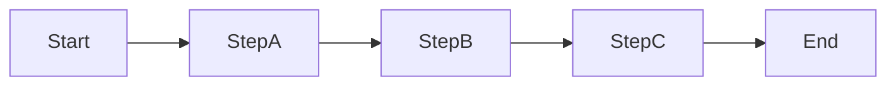
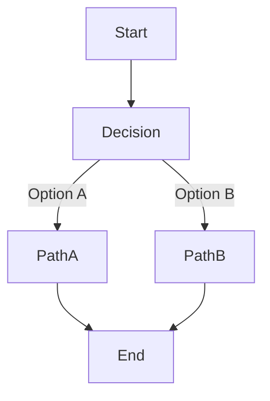
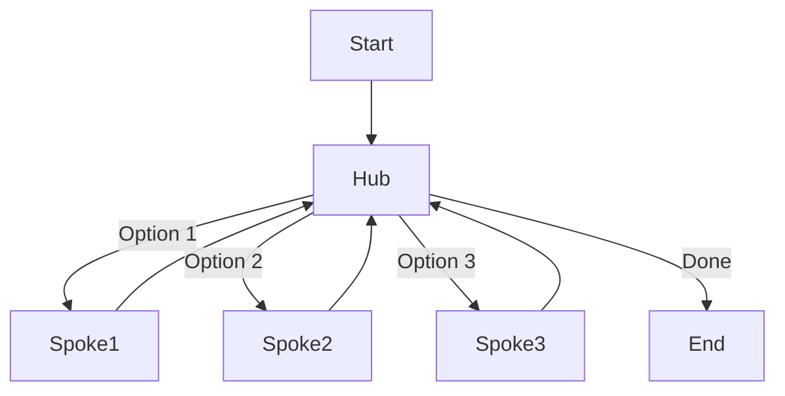

# Agent Flows

Agent flows are at the heart of SOFIA's approach to building structured, predictable AI assistants. This page explains how steps and routes work together to create a coherent conversation flow.

## What Are Agent Flows?

Agent flows define the conversational path an agent can take. They provide structure to AI interactions, making them more predictable and easier to design.

<Callout type="info">
  Unlike simple chatbots that respond to each message independently, SOFIA agents follow defined paths, making them ideal for guided conversations and multi-step processes.
</Callout>

## Steps

Steps are the building blocks of agent flows. Each step represents a distinct state or phase in the conversation.

### Anatomy of a Step

A step has the following components:

```python
Step(
    step_id="collect_order",
    description="Collect the customer's coffee order details.",
    available_tools=["validate_order", "check_inventory"],
    routes=[
        Route(target="payment", condition="Order is complete and valid"),
        Route(target="recommendations", condition="Customer is unsure what to order")
    ]
)
```

| Property | Description |
|----------|-------------|
| `step_id` | A unique identifier for the step |
| `description` | Explains the purpose of the step to the LLM |
| `available_tools` | List of tools the agent can use in this step |
| `routes` | Possible transitions to other steps |

### Step Behavior

When an agent is in a particular step:

1. It can only use the tools specified in `available_tools`
2. It can only transition to steps defined in `routes`
3. The `description` guides the LLM on how to behave in this step

## Routes

Routes define the possible transitions between steps. They create the pathways in your agent's conversation flow.

### Route Properties

A route consists of:

```python
Route(
    target="payment",
    condition="Order is complete and valid"
)
```

| Property | Description |
|----------|-------------|
| `target` | The `step_id` of the destination step |
| `condition` | A description of when this route should be taken |

### Route Decision-Making

The LLM decides which route to take based on:

1. The current conversation context
2. The route conditions
3. The user's most recent input

The conditions are described in natural language, allowing the LLM to make semantically appropriate decisions about which route to follow.

## Flow Design Patterns

Here are some common patterns for designing effective agent flows:

### Linear Flow

A simple sequence of steps, useful for guided processes:

<div className="flex justify-center my-8">

</div>

```python
steps = [
    Step(
        step_id="start",
        description="Begin the conversation.",
        routes=[Route(target="step_a", condition="Always proceed")]
    ),
    Step(
        step_id="step_a",
        description="Handle step A.",
        routes=[Route(target="step_b", condition="Step A is complete")]
    ),
    Step(
        step_id="step_b",
        description="Handle step B.",
        routes=[Route(target="step_c", condition="Step B is complete")]
    ),
    Step(
        step_id="step_c",
        description="Handle step C.",
        routes=[Route(target="end", condition="Step C is complete")]
    ),
    Step(
        step_id="end",
        description="End the conversation."
    )
]
```

### Branching Flow

Allows different paths based on user choices:

<div className="flex justify-center my-8">

</div>

```python
steps = [
    Step(
        step_id="start",
        description="Begin the conversation.",
        routes=[Route(target="decision", condition="Always proceed")]
    ),
    Step(
        step_id="decision",
        description="Ask the user to choose option A or B.",
        routes=[
            Route(target="path_a", condition="User chose option A"),
            Route(target="path_b", condition="User chose option B")
        ]
    ),
    Step(
        step_id="path_a",
        description="Handle option A.",
        routes=[Route(target="end", condition="Option A is handled")]
    ),
    Step(
        step_id="path_b",
        description="Handle option B.",
        routes=[Route(target="end", condition="Option B is handled")]
    ),
    Step(
        step_id="end",
        description="End the conversation."
    )
]
```

### Hub-and-Spoke Flow

A central hub with multiple possible steps that return to the hub:

<div className="flex justify-center my-8">

</div>

```python
steps = [
    Step(
        step_id="start",
        description="Begin the conversation.",
        routes=[Route(target="hub", condition="Always proceed")]
    ),
    Step(
        step_id="hub",
        description="Central hub for choosing actions.",
        routes=[
            Route(target="spoke1", condition="User wants option 1"),
            Route(target="spoke2", condition="User wants option 2"),
            Route(target="spoke3", condition="User wants option 3"),
            Route(target="end", condition="User is done")
        ]
    ),
    Step(
        step_id="spoke1",
        description="Handle option 1.",
        routes=[Route(target="hub", condition="Option 1 is handled")]
    ),
    Step(
        step_id="spoke2",
        description="Handle option 2.",
        routes=[Route(target="hub", condition="Option 2 is handled")]
    ),
    Step(
        step_id="spoke3",
        description="Handle option 3.",
        routes=[Route(target="hub", condition="Option 3 is handled")]
    ),
    Step(
        step_id="end",
        description="End the conversation."
    )
]
```

## Best Practices

### Clear Step Descriptions

Write clear, detailed step descriptions that explain:
- The purpose of the step
- What information to collect or provide
- How to respond to different user inputs

### Meaningful Route Conditions

Make route conditions specific and unambiguous:
- Bad: `"User is ready"`
- Good: `"User has provided their name, email, and confirmed the information is correct"`

### Appropriate Tool Availability

Only include tools that are relevant to the current step:
- It focuses the agent on the current task
- Reduces the chance of inappropriate tool use
- Makes debugging easier

### Graceful Error Handling

Include routes for handling errors:
- Routes for incomplete information
- Steps for handling unexpected inputs
- Paths back to previous steps when needed

## Next Steps

- [Tools Integration](/docs/concepts/tools-integration): Learn how to enhance your agent with tools
- [Examples](/docs/examples/barista): See agent flows in action with real-world examples
- [Guides](/docs/guides/configuration): Learn about advanced configuration options
