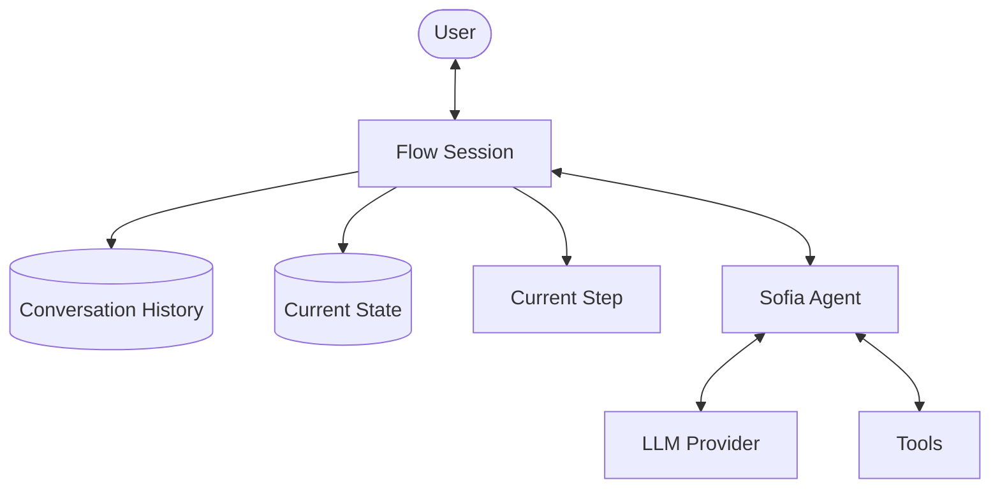
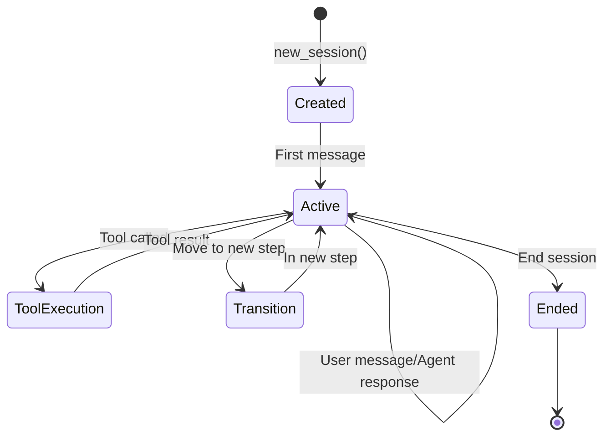

# Session Management

Session management is a core concept in SOFIA that enables conversational agents to maintain state, track history, and ensure a coherent user experience throughout interactions. This page explains how sessions work in SOFIA and how to use them effectively.

## What is a Session?

A session in SOFIA represents a single conversation between a user and an agent. It:

- Tracks the current step in the agent's flow
- Maintains conversation history
- Handles state persistence
- Manages tool calls and results
- Provides context for LLM decisions

<div className="flex justify-center my-8">

</div>

## Session Lifecycle

<div className="flex justify-center my-8">

</div>

1. **Creation**: A session is created when a user starts a conversation
2. **Activation**: The session becomes active when the first message is sent
3. **User Interaction**: User sends messages, agent responds
4. **Tool Execution**: Agent calls tools as needed
5. **Step Transitions**: Agent moves between steps based on the flow
6. **Termination**: Session ends when the conversation is complete

## Creating and Managing Sessions

### Creating a Session

```python
# Create a SOFIA agent
sofia = Sofia(
    name="customer_service",
    steps=[Step(step_id="start", description="Initial greeting")],
    # Other configuration...
)

# Create a new session
session = sofia.new_session()
```

### Sending Messages

```python
# User sends a message
response = session.send_message("I need help with my order")

# Get the response
print(response.message)
```

### Session Identification

Each session has a unique ID that can be used to retrieve the session later:

```python
# Get the session ID
session_id = session.session_id
print(f"Session ID: {session_id}")

# Later, retrieve the session using the ID
retrieved_session = sofia.get_session(session_id)
```

## Session State

The session state includes:

### Current Step

The current position in the agent's flow:

```python
# Get the current step
current_step_id = session.current_step
print(f"Current step: {current_step_id}")
```

### Conversation History

The complete history of the conversation:

```python
# Access the conversation history
history = session.history
for entry in history:
    print(f"{entry.role}: {entry.content}")
```

### Session Variables

Custom variables that can be stored in the session:

```python
# Set a session variable
session.set_variable("customer_name", "John")

# Get a session variable
name = session.get_variable("customer_name")
print(f"Customer name: {name}")
```

## Persistence Options

SOFIA supports different persistence options for sessions:

<Tabs>
  <Tab label="In-Memory">
    ```python
    # Default: In-memory storage (no persistence)
    sofia = Sofia(
        name="simple_agent",
        # No persistence configuration needed
    )
    ```
  </Tab>
  <Tab label="Redis">
    ```python
    # Redis persistence
    sofia = Sofia(
        name="persistent_agent",
        session_store=RedisSessionStore(
            redis_url="redis://localhost:6379/0"
        )
    )
    ```
  </Tab>
  <Tab label="Custom Storage">
    ```python
    # Custom persistence implementation
    class MySessionStore(SessionStoreBase):
        def save_session(self, session):
            # Implementation
            
        def load_session(self, session_id):
            # Implementation
            
        def delete_session(self, session_id):
            # Implementation
    
    sofia = Sofia(
        name="custom_persistent_agent",
        session_store=MySessionStore()
    )
    ```
  </Tab>
</Tabs>

## Session Management Best Practices

### Session Timeout

Set appropriate session timeout values:

```python
# Set session timeout to 30 minutes
sofia = Sofia(
    name="timeout_agent",
    session_timeout=30 * 60,  # 30 minutes in seconds
    # Other configuration...
)
```

### Session Cleanup

Implement cleanup for expired sessions:

```python
# Clean up expired sessions
sofia.cleanup_sessions()
```

### Session Metadata

Add metadata to sessions for easier management:

```python
# Create a session with metadata
session = sofia.new_session(metadata={
    "user_id": "user123",
    "channel": "website",
    "locale": "en-US"
})

# Later, access the metadata
user_id = session.metadata.get("user_id")
```

## Session Events

SOFIA can emit events during a session for monitoring or integration:

```python
# Register an event handler
def on_step_change(event):
    print(f"Step changed from {event.previous_step} to {event.current_step}")

sofia.on("step_change", on_step_change)
```

Available events include:
- `session_created`
- `message_received`
- `message_sent`
- `tool_called`
- `tool_result_received`
- `step_change`
- `session_ended`

## Session Monitoring

Monitor active sessions:

```python
# Get all active sessions
active_sessions = sofia.get_active_sessions()
print(f"Active sessions: {len(active_sessions)}")

# Get session statistics
stats = sofia.get_session_stats()
print(f"Total sessions: {stats.total}")
print(f"Active sessions: {stats.active}")
print(f"Average session duration: {stats.avg_duration} seconds")
```

## Advanced Session Management

### Session Forking

Create a new session based on an existing one:

```python
# Fork a session (creates a copy with a new ID)
new_session = sofia.fork_session(original_session.session_id)
```

### State Snapshots

Create and restore session snapshots:

```python
# Take a snapshot of the current session state
snapshot = session.create_snapshot()

# Later, restore from the snapshot
restored_session = sofia.restore_session_from_snapshot(snapshot)
```

### Parallel Sessions

Handle multiple sessions concurrently:

```python
# Create multiple sessions
sessions = [sofia.new_session() for _ in range(5)]

# Process messages in parallel
import asyncio

async def process_message(session, message):
    response = await session.send_message_async(message)
    return response

async def process_all():
    messages = ["Hello", "How are you?", "What's the weather?", "Thank you", "Goodbye"]
    tasks = [process_message(session, message) 
             for session, message in zip(sessions, messages)]
    responses = await asyncio.gather(*tasks)
    return responses

responses = asyncio.run(process_all())
```

## Session Security

Implement security best practices for session management:

1. **Session Token Validation**: Validate session tokens on each request
2. **Secure Storage**: Use encrypted storage for sensitive session data
3. **Authorization Checks**: Verify user permissions for session access
4. **Rate Limiting**: Implement rate limiting to prevent abuse
5. **Session Invalidation**: Provide mechanisms to invalidate sessions

<Callout type="warning">
  When storing session data, be mindful of data privacy regulations like GDPR. Implement appropriate data retention and cleanup policies.
</Callout>

## Next Steps

- Learn about [LLM Integration](/concepts/llm-integration) to understand how the LLM interacts with sessions
- Explore [Deployment](/guides/deployment) to learn how to scale session management
- Visit [Monitoring and Debugging](/guides/monitoring) for information on monitoring session activity
