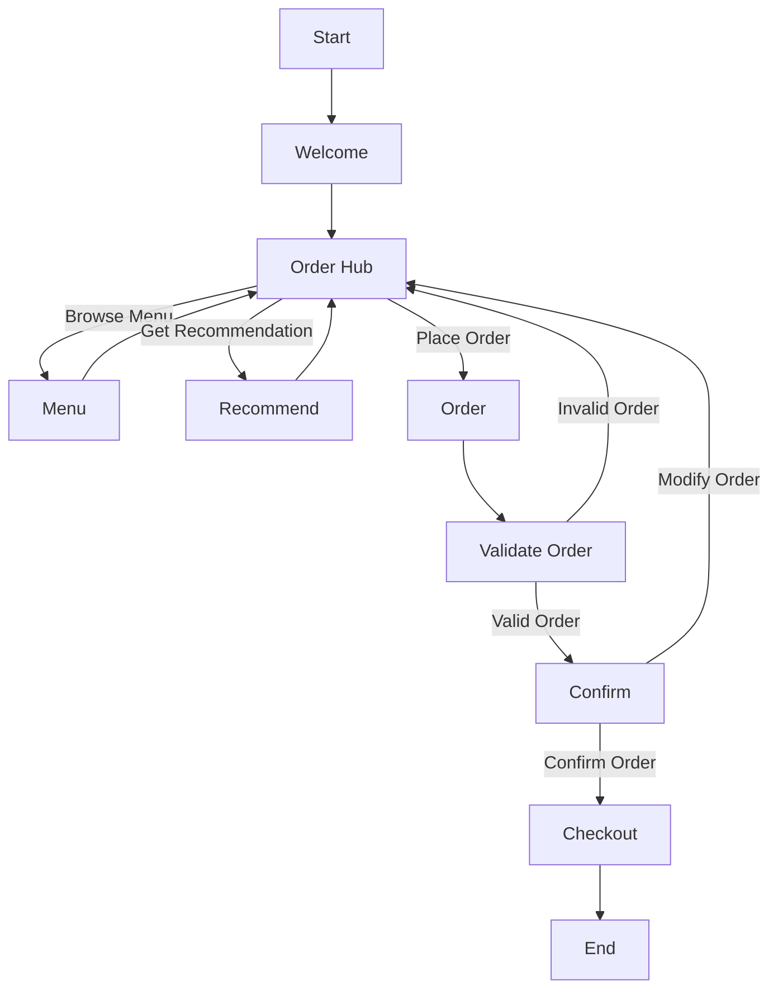

# Barista Agent Example

This example demonstrates how to build a coffee ordering agent using SOFIA. The Barista agent helps users order coffee, validates their orders, and guides them through the ordering process.

<Callout type="info">
  The full example code is available in the [SOFIA GitHub repository](https://github.com/poly-eye/sofia/tree/main/examples/barista).
</Callout>

## Features

- Multi-step ordering process
- Order validation
- Menu browsing
- Recommendation system
- Size, milk, and flavor customization

## Agent Flow

The Barista agent follows a hub-and-spoke flow pattern:

<div className="flex justify-center my-8">

</div>

## Implementation

Here's how the agent is implemented using SOFIA:

### Tools

First, we define the tools the agent will use:

```python
def get_menu():
    """Get the coffee menu."""
    return {
        "drip": {"desc": "Classic drip coffee", "price": 2.50},
        "latte": {"desc": "Espresso with steamed milk", "price": 4.00},
        "cappuccino": {"desc": "Espresso with equal parts steamed milk and foam", "price": 4.50},
        "mocha": {"desc": "Espresso with chocolate and steamed milk", "price": 4.75},
        "espresso": {"desc": "Concentrated coffee served in shots", "price": 3.00},
    }

def validate_order(coffee_type, size, milk=None, flavors=None):
    """Validate a coffee order."""
    menu = get_menu()
    sizes = ["small", "medium", "large"]
    milks = [None, "whole", "skim", "oat", "almond", "soy"]
    valid_flavors = [None, "vanilla", "caramel", "hazelnut", "chocolate"]
    
    if coffee_type not in menu:
        return f"Invalid coffee type. Available types: {', '.join(menu.keys())}"
    
    if size not in sizes:
        return f"Invalid size. Available sizes: {', '.join(sizes)}"
    
    if milk not in milks:
        return f"Invalid milk. Available options: {', '.join([m for m in milks if m])}"
    
    if flavors:
        if not isinstance(flavors, list):
            flavors = [flavors]
        for flavor in flavors:
            if flavor not in valid_flavors:
                return f"Invalid flavor: {flavor}. Available flavors: {', '.join([f for f in valid_flavors if f])}"
    
    return "Order is valid"

def get_total_price(coffee_type, size, flavors=None):
    """Calculate the total price of a coffee order."""
    menu = get_menu()
    base_price = menu[coffee_type]["price"]
    
    # Size adjustments
    if size == "small":
        base_price -= 0.50
    elif size == "large":
        base_price += 0.75
    
    # Flavor additions
    if flavors:
        if not isinstance(flavors, list):
            flavors = [flavors]
        base_price += len(flavors) * 0.50
    
    return f"${base_price:.2f}"
```

### Steps

Next, we define the steps and routes:

```python
steps = [
    Step(
        step_id="start",
        description="Starting point for the conversation.",
        routes=[Route(target="welcome", condition="Always route to welcome")]
    ),
    Step(
        step_id="welcome",
        description="Welcome the user and explain what this bot can do: take coffee orders, show menu, and make recommendations.",
        routes=[Route(target="order_hub", condition="After welcoming the user")]
    ),
    Step(
        step_id="order_hub",
        description="Central hub for ordering. Ask if the user wants to see the menu, get a recommendation, or place an order.",
        available_tools=["get_menu"],
        routes=[
            Route(target="menu", condition="User wants to see the menu"),
            Route(target="recommend", condition="User wants a recommendation"),
            Route(target="order", condition="User wants to place an order"),
            Route(target="end", condition="User wants to end the conversation")
        ]
    ),
    Step(
        step_id="menu",
        description="Show the coffee menu with descriptions and prices.",
        available_tools=["get_menu"],
        routes=[Route(target="order_hub", condition="After showing the menu")]
    ),
    Step(
        step_id="recommend",
        description="Recommend coffee based on user preferences (e.g., strong, mild, sweet, etc.).",
        available_tools=["get_menu"],
        routes=[Route(target="order_hub", condition="After making a recommendation")]
    ),
    Step(
        step_id="order",
        description="Take a coffee order. Ask for coffee type, size, milk type, and any flavor additions if not provided.",
        available_tools=["get_menu", "validate_order"],
        routes=[Route(target="validate", condition="User has provided all order details")]
    ),
    Step(
        step_id="validate",
        description="Validate the coffee order.",
        available_tools=["validate_order"],
        routes=[
            Route(target="order_hub", condition="Order is invalid and user needs to try again"),
            Route(target="confirm", condition="Order is valid and ready for confirmation")
        ]
    ),
    Step(
        step_id="confirm",
        description="Confirm the order details and ask if the user wants to proceed.",
        available_tools=["get_total_price"],
        routes=[
            Route(target="order_hub", condition="User wants to modify the order"),
            Route(target="checkout", condition="User confirms the order")
        ]
    ),
    Step(
        step_id="checkout",
        description="Process the order, tell the user their order number, and thank them.",
        routes=[Route(target="end", condition="Order is complete")]
    ),
    Step(
        step_id="end",
        description="End the conversation."
    )
]
```

### Creating the Agent

Finally, we create the agent:

```python
from sofia_agent import *
from sofia_agent.llms import OpenAIChatLLM

llm = OpenAIChatLLM()
agent = Sofia(
    name="barista",
    llm=llm,
    steps=steps,
    start_step_id="start",
    tools=[get_menu, validate_order, get_total_price],
    persona="You are a friendly barista at a coffee shop, helping customers with their orders. You're knowledgeable about coffee and provide excellent customer service."
)
```

## Using YAML Configuration

Alternatively, you can define the agent using YAML:

```yaml
name: barista
persona: You are a friendly barista at a coffee shop, helping customers with their orders. You're knowledgeable about coffee and provide excellent customer service.
steps:
  - step_id: start
    description: Starting point for the conversation.
    routes:
      - target: welcome
        condition: Always route to welcome
  
  - step_id: welcome
    description: Welcome the user and explain what this bot can do...
    routes:
      - target: order_hub
        condition: After welcoming the user
  
  # ... more steps
  
start_step_id: start
```

## Running the Agent

To run the agent:

```python
session = agent.create_session()

def chat_loop():
    print("Barista: Welcome to our coffee shop! How can I help you today?")
    while True:
        user_input = input("You: ")
        if user_input.lower() == "exit":
            break
        decision, _ = session.next(user_input)
        print(f"Barista: {decision.input}")

chat_loop()
```

## Sample Conversation

Here's an example of how a conversation with the Barista agent might go:

<div className="border p-4 mb-4 bg-gray-50 dark:bg-gray-900 rounded">
**Barista**: Welcome to our coffee shop! How can I help you today?

**User**: What's on the menu?

**Barista**: Here's our coffee menu:

- Drip: Classic drip coffee - $2.50
- Latte: Espresso with steamed milk - $4.00
- Cappuccino: Espresso with equal parts steamed milk and foam - $4.50
- Mocha: Espresso with chocolate and steamed milk - $4.75
- Espresso: Concentrated coffee served in shots - $3.00

Would you like a recommendation, or are you ready to place an order?

**User**: I'd like a latte please

**Barista**: Great choice! I'll help you customize your latte. 

What size would you like? We have small, medium, and large.

**User**: Medium with oat milk

**Barista**: Excellent! Would you like to add any flavors to your medium oat milk latte? We have vanilla, caramel, hazelnut, and chocolate.

**User**: Vanilla please

**Barista**: Perfect! Let me confirm your order:
- Medium vanilla latte with oat milk
- Total price: $4.50

Is that correct, or would you like to make any changes?

**User**: That's correct

**Barista**: Thank you for your order! Your order number is #A237. Your medium vanilla latte with oat milk will be ready shortly. Enjoy your coffee!
</div>

## Key Takeaways

This example demonstrates several important SOFIA concepts:

1. **Step-based flows**: The conversation follows a logical flow with defined steps
2. **Tool integration**: Custom functions enhance the agent's capabilities
3. **Validation**: The agent validates user input before proceeding
4. **Hub-and-spoke pattern**: The order_hub step serves as a central point for navigation

## Next Steps

- [Try the Financial Advisor example](/docs/examples/financial-advisor) for a more complex use case
- [Learn about deploying agents](/docs/guides/deployment) to make them accessible via API
- [Explore tool integration](/docs/concepts/tools-integration) for adding more capabilities to your agents
