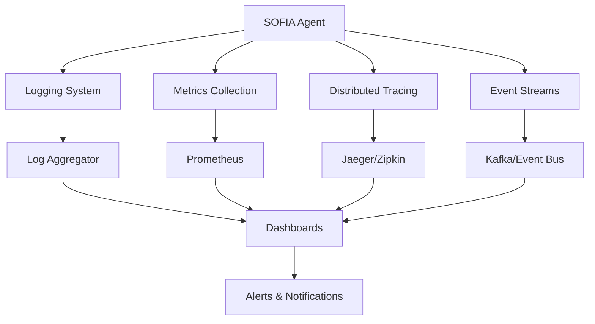
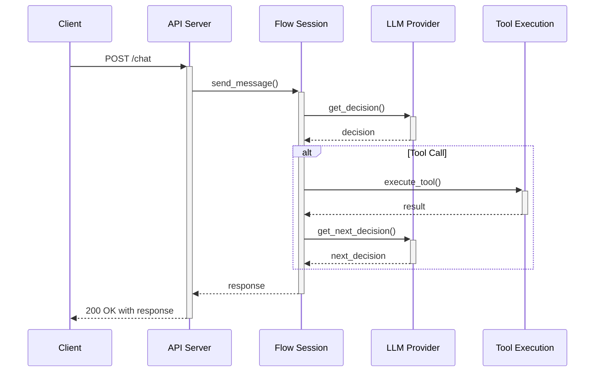
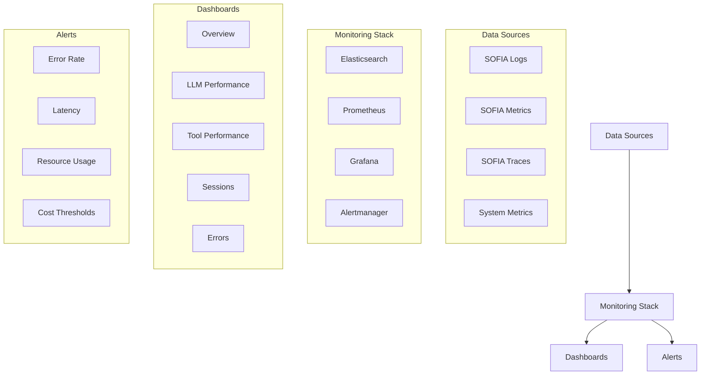

# Monitoring and Debugging

Effective monitoring and debugging are essential for maintaining reliable SOFIA agents. This guide covers how to monitor your agents, set up logging and tracing, troubleshoot common issues, and implement best practices for production deployments.

## Monitoring Architecture

A comprehensive monitoring setup for SOFIA includes:

<div className="flex justify-center my-8">

</div>

## Logging Configuration

SOFIA uses Python's built-in logging framework, which you can configure to suit your needs:

```python
import logging
from sofia import Sofia
from sofia.utils.logging import configure_logging

# Configure logging
configure_logging(
    level=logging.INFO,
    log_format="%(asctime)s - %(name)s - %(levelname)s - %(message)s",
    log_file="sofia.log",
    console=True
)

# Create a SOFIA agent with logging enabled
sofia = Sofia(
    name="monitored_agent",
    enable_logging=True,
    # Other configuration...
)
```

### Log Levels

SOFIA uses the following log levels:

| Level | When to Use |
|-------|-------------|
| DEBUG | Detailed information for debugging |
| INFO | Confirmation that things are working as expected |
| WARNING | Indication that something unexpected happened |
| ERROR | Errors that prevent a function from working |
| CRITICAL | Serious errors that may prevent the application from continuing |

### Structured Logging

For production environments, configure structured JSON logging:

```python
from sofia.utils.logging import configure_json_logging

configure_json_logging(
    level=logging.INFO,
    additional_fields={
        "environment": "production",
        "service": "sofia-agent"
    }
)
```

Example output:
```json
{
  "timestamp": "2023-06-15T12:34:56.789Z",
  "level": "INFO",
  "message": "Session started",
  "session_id": "sess_12345",
  "environment": "production",
  "service": "sofia-agent"
}
```

## Metrics Collection

SOFIA can expose metrics for monitoring:

```python
from sofia import Sofia
from sofia.utils.metrics import PrometheusMetrics

# Initialize metrics
metrics = PrometheusMetrics(
    app=None,  # Pass your FastAPI app here if using FastAPI
    metrics_port=8001,  # Port for Prometheus metrics endpoint
    path="/metrics"  # Path for metrics endpoint
)

# Create a SOFIA agent with metrics
sofia = Sofia(
    name="metrics_enabled_agent",
    metrics=metrics,
    # Other configuration...
)
```

### Key Metrics to Monitor

SOFIA exposes these key metrics:

1. **Request Metrics**:
   - Request count
   - Request duration
   - Request errors

2. **LLM Metrics**:
   - LLM call count
   - LLM token usage
   - LLM response time
   - LLM errors

3. **Tool Metrics**:
   - Tool call count
   - Tool execution time
   - Tool error rate

4. **Session Metrics**:
   - Active sessions
   - Session duration
   - Messages per session

5. **System Metrics**:
   - CPU usage
   - Memory usage
   - Disk I/O
   - Network I/O

### Prometheus Configuration

Example Prometheus configuration for scraping SOFIA metrics:

```yaml
# prometheus.yml
scrape_configs:
  - job_name: 'sofia'
    scrape_interval: 15s
    static_configs:
      - targets: ['sofia-service:8001']
```

## Distributed Tracing

For complex deployments, distributed tracing helps visualize request flow:

```python
from sofia import Sofia
from sofia.utils.tracing import configure_tracing, trace

# Configure OpenTelemetry tracing
configure_tracing(
    service_name="sofia-agent",
    jaeger_endpoint="http://jaeger:14268/api/traces"
)

# Create a SOFIA agent with tracing
sofia = Sofia(
    name="traced_agent",
    enable_tracing=True,
    # Other configuration...
)

# Use the trace decorator for custom functions
@trace()
def process_customer_request(customer_id, request_type):
    # Function implementation
    pass
```

### Tracing Flow

A typical trace for a SOFIA agent includes:

<div className="flex justify-center my-8">

</div>

Each of these operations creates a span in the trace, allowing you to see:
- How long each step takes
- Where bottlenecks occur
- Error locations and contexts

## Elastic APM Integration

SOFIA integrates with Elastic APM for performance monitoring:

```python
from sofia import Sofia
from sofia.utils.monitoring import configure_elastic_apm

# Configure Elastic APM
configure_elastic_apm(
    service_name="sofia-agent",
    server_url="http://apm-server:8200",
    environment="production",
    secret_token="your-secret-token"
)

# Create a SOFIA agent with Elastic APM
sofia = Sofia(
    name="apm_monitored_agent",
    enable_apm=True,
    # Other configuration...
)
```

### APM Dashboard

The Elastic APM dashboard provides insights into:
- Transaction durations
- Error rates and details
- Throughput
- Service maps
- Dependencies

## Event Streaming

For real-time monitoring, configure event streaming:

```python
from sofia import Sofia
from sofia.utils.events import EventStream

# Configure event streaming
event_stream = EventStream(
    stream_type="kafka",
    config={
        "bootstrap.servers": "kafka:9092",
        "topic": "sofia-events"
    }
)

# Create a SOFIA agent with event streaming
sofia = Sofia(
    name="event_streaming_agent",
    event_stream=event_stream,
    # Other configuration...
)

# Subscribe to events
@event_stream.on("message_received")
def handle_message(event):
    print(f"New message from {event.user_id}: {event.message}")

@event_stream.on("tool_called")
def handle_tool_call(event):
    print(f"Tool called: {event.tool_name} with params {event.params}")
```

## Debugging Tools

### Session Inspection

Inspect active sessions for debugging:

```python
# Get a session by ID
session = sofia.get_session("session_123")

# Print session details
print(f"Current step: {session.current_step}")
print(f"History length: {len(session.history)}")
print(f"Variables: {session.variables}")

# Print conversation history
for message in session.history:
    print(f"{message.role}: {message.content}")
```

### LLM Debugging

Debug LLM interactions:

```python
from sofia import Sofia
from sofia.utils.debugging import LLMDebugger

# Create a debugger
llm_debugger = LLMDebugger(
    log_prompts=True,
    log_responses=True,
    log_tokens=True,
    output_dir="debug_logs"
)

# Create a SOFIA agent with LLM debugging
sofia = Sofia(
    name="llm_debug_agent",
    llm_debugger=llm_debugger,
    # Other configuration...
)
```

The LLM debugger will save:
- All prompts sent to the LLM
- All responses received
- Token counts and costs
- Timing information

### Tool Debugging

Debug tool execution:

```python
from sofia import Sofia
from sofia.utils.debugging import ToolDebugger

# Create a tool debugger
tool_debugger = ToolDebugger(
    log_calls=True,
    log_results=True,
    log_errors=True,
    output_dir="tool_logs"
)

# Create a SOFIA agent with tool debugging
sofia = Sofia(
    name="tool_debug_agent",
    tool_debugger=tool_debugger,
    # Other configuration...
)
```

## Local Development Monitoring

For local development, SOFIA provides a built-in monitoring dashboard:

```python
from sofia import Sofia
from sofia.server import create_app, enable_debug_dashboard

# Create a SOFIA agent
sofia = Sofia(
    name="dev_agent",
    # Configuration...
)

# Create a FastAPI application with debug dashboard
app = create_app(sofia)
enable_debug_dashboard(app)

# Run the server
if __name__ == "__main__":
    import uvicorn
    uvicorn.run(app, host="0.0.0.0", port=8000)
```

This creates a dashboard at `/debug` that shows:
- Active sessions
- Recent requests
- Tool calls
- LLM interactions
- Performance metrics

## Common Issues and Troubleshooting

<Tabs>
  <Tab label="LLM Issues">
    ### Common LLM Problems
    
    **Issue: API Rate Limiting**
    - **Symptoms**: 429 errors, failed requests
    - **Solution**: Implement rate limiting and retry logic
    
    ```python
    sofia = Sofia(
        name="rate_limited_agent",
        llm_config={
            "model": "gpt-4",
            "api_key": "your-api-key",
            "retry_count": 5,
            "retry_base_delay": 1,  # seconds
            "retry_max_delay": 60,  # seconds
            "rate_limit_requests": 50,  # requests per minute
        }
    )
    ```
    
    **Issue: Inconsistent LLM Responses**
    - **Symptoms**: Unexpected agent behavior, varying responses
    - **Solution**: Set a lower temperature or use seed for deterministic results
    
    ```python
    sofia = Sofia(
        name="deterministic_agent",
        llm_config={
            "model": "gpt-4",
            "api_key": "your-api-key",
            "temperature": 0.2,  # Lower temperature
            "seed": 42  # Deterministic seed
        }
    )
    ```
    
    **Issue: High Token Usage**
    - **Symptoms**: Increased costs, truncated responses
    - **Solution**: Implement history summarization, optimize prompts
    
    ```python
    sofia = Sofia(
        name="optimized_agent",
        llm_config={
            "model": "gpt-4",
            "api_key": "your-api-key",
            "history_token_limit": 2000,  # Limit history tokens
            "summarize_history": True  # Summarize long histories
        }
    )
    ```
  </Tab>
  <Tab label="Tool Issues">
    ### Common Tool Problems
    
    **Issue: Tool Execution Errors**
    - **Symptoms**: Failed tool calls, error responses
    - **Solution**: Improve error handling, validate inputs
    
    ```python
    def search_database(query: str) -> dict:
        """Search the database for information.
        
        Args:
            query: The search query
            
        Returns:
            Search results
        """
        try:
            # Input validation
            if not query or len(query) < 3:
                return {"error": "Query too short", "results": []}
                
            # Execute search
            results = db.execute_search(query)
            return {"results": results}
        except Exception as e:
            # Log the error
            logging.error(f"Search error: {str(e)}")
            return {"error": str(e), "results": []}
    ```
    
    **Issue: Slow Tool Execution**
    - **Symptoms**: High latency, timeouts
    - **Solution**: Implement timeouts, caching, async execution
    
    ```python
    import asyncio
    import functools
    import time
    from cachetools import TTLCache

    # Create a cache with 100 items and 10-minute TTL
    cache = TTLCache(maxsize=100, ttl=600)

    def cached_tool(func):
        @functools.wraps(func)
        def wrapper(*args, **kwargs):
            # Create a cache key from args and kwargs
            key = str(args) + str(sorted(kwargs.items()))
            
            # Check if result is in cache
            if key in cache:
                return cache[key]
            
            # Execute function with timeout
            start_time = time.time()
            result = func(*args, **kwargs)
            duration = time.time() - start_time
            
            # Log execution time
            logging.info(f"Tool {func.__name__} executed in {duration:.2f}s")
            
            # Cache the result
            cache[key] = result
            return result
        return wrapper

    @cached_tool
    def expensive_operation(param: str) -> dict:
        # Implementation
        pass
    ```
    
    **Issue: Tool Not Being Used**
    - **Symptoms**: LLM doesn't use available tools
    - **Solution**: Improve tool documentation, use example invocations
    
    ```python
    def format_date(date_string: str, output_format: str = "YYYY-MM-DD") -> str:
        """Format a date string to the specified format.
        
        Args:
            date_string: The input date string (e.g., "January 1, 2023", "01/01/2023")
            output_format: The desired output format (e.g., "YYYY-MM-DD", "MM/DD/YYYY")
            
        Returns:
            The formatted date string
            
        Example:
            Input: format_date("January 1, 2023", "MM/DD/YYYY")
            Output: "01/01/2023"
        """
        # Implementation
        pass
    ```
  </Tab>
  <Tab label="Session Issues">
    ### Common Session Problems
    
    **Issue: Lost Session State**
    - **Symptoms**: Conversation context lost, agent "forgets"
    - **Solution**: Configure persistent session store
    
    ```python
    from sofia import Sofia
    from sofia.session import RedisSessionStore
    
    # Create a Redis session store
    session_store = RedisSessionStore(
        redis_url="redis://localhost:6379/0",
        prefix="sofia:",
        expire=3600  # Session TTL in seconds
    )
    
    # Create a SOFIA agent with persistent sessions
    sofia = Sofia(
        name="persistent_agent",
        session_store=session_store,
        # Other configuration...
    )
    ```
    
    **Issue: Session Memory Growth**
    - **Symptoms**: Increasing memory usage, slower responses
    - **Solution**: Configure history truncation, summarization
    
    ```python
    sofia = Sofia(
        name="memory_efficient_agent",
        session_config={
            "max_history_messages": 50,  # Limit message count
            "summarize_threshold": 30,   # Summarize when exceeding
            "system_message_retention": True  # Always keep system message
        }
    )
    ```
    
    **Issue: Session Timeout**
    - **Symptoms**: Sessions end unexpectedly
    - **Solution**: Configure appropriate timeouts
    
    ```python
    sofia = Sofia(
        name="long_lived_agent",
        session_config={
            "session_timeout": 86400,  # 24-hour timeout
            "session_refresh_on_activity": True,  # Reset timeout on activity
            "inactive_session_check_interval": 3600  # Check hourly
        }
    )
    ```
  </Tab>
</Tabs>

## Error Handling

Implement proper error handling for production:

```python
from sofia import Sofia
from fastapi import FastAPI, Request
from fastapi.responses import JSONResponse

app = FastAPI()

# Create a SOFIA agent
sofia = Sofia(
    name="error_handled_agent",
    # Configuration...
)

# Add exception handlers
@app.exception_handler(Exception)
async def generic_exception_handler(request: Request, exc: Exception):
    # Log the error
    logging.error(f"Unhandled exception: {str(exc)}", exc_info=True)
    
    # Return a friendly response
    return JSONResponse(
        status_code=500,
        content={
            "error": "An unexpected error occurred",
            "message": str(exc),
            "request_id": request.headers.get("X-Request-ID")
        }
    )

# Create chat endpoint with error handling
@app.post("/chat")
async def chat(request: Request, chat_request: dict):
    try:
        # Process the chat request
        session_id = chat_request.get("session_id")
        message = chat_request.get("message")
        
        # Get or create session
        if session_id:
            session = sofia.get_session(session_id)
            if not session:
                return JSONResponse(
                    status_code=404,
                    content={"error": "Session not found"}
                )
        else:
            session = sofia.new_session()
        
        # Send message and get response
        response = session.send_message(message)
        
        # Return response
        return {
            "session_id": session.session_id,
            "message": response.message,
            "step": session.current_step
        }
    except Exception as e:
        # Log the error
        logging.error(f"Chat error: {str(e)}", exc_info=True)
        
        # Return error response
        return JSONResponse(
            status_code=500,
            content={
                "error": "Failed to process chat message",
                "message": str(e),
                "request_id": request.headers.get("X-Request-ID")
            }
        )
```

## Monitoring Dashboard

For production monitoring, set up a dashboard with:

1. **Real-time metrics**: Active sessions, requests per minute, error rate
2. **LLM usage**: Tokens used, costs, average response time
3. **Tool performance**: Tool usage, success rate, average execution time
4. **System health**: CPU, memory, disk, network usage
5. **Alerts**: Configured for key metrics and errors

<div className="flex justify-center my-8">

</div>

## Scheduled Health Checks

Implement regular health checks:

```python
from apscheduler.schedulers.background import BackgroundScheduler
import requests

def check_agent_health():
    try:
        # Check API health
        response = requests.get("http://localhost:8000/health")
        if response.status_code != 200:
            logging.error(f"Health check failed: {response.text}")
            # Send alert (e.g., email, Slack)
            send_alert("Agent health check failed")
        else:
            logging.info("Health check passed")
    except Exception as e:
        logging.error(f"Health check error: {str(e)}")
        send_alert(f"Agent health check error: {str(e)}")

# Create a scheduler
scheduler = BackgroundScheduler()
scheduler.add_job(check_agent_health, 'interval', minutes=5)
scheduler.start()
```

## Debugging Best Practices

1. **Use structured logging**: Include context in logs
2. **Enable verbose logging in development**: Set log level to DEBUG
3. **Create test sessions**: Test agent behavior with controlled inputs
4. **Use session playback**: Replay problematic sessions for debugging
5. **Implement circuit breakers**: Prevent cascading failures
6. **Regularly audit tool usage**: Detect unused or problematic tools
7. **Monitor token usage**: Track costs and optimize prompting
8. **Use canary deployments**: Test changes with a subset of traffic

<Callout type="info">
  For production debugging, create a special debug mode that can be enabled for specific sessions without affecting all users.
</Callout>

## Monitoring Checklist

- [ ] Configure structured logging
- [ ] Set up metrics collection
- [ ] Implement distributed tracing
- [ ] Create monitoring dashboards
- [ ] Set up alerts for critical issues
- [ ] Configure health checks
- [ ] Implement error handling
- [ ] Set up log rotation and archiving
- [ ] Create runbooks for common issues
- [ ] Document monitoring infrastructure

## Next Steps

- Learn about [Extending SOFIA](/guides/extending-sofia) to customize SOFIA for your needs
- Explore [API Reference](/api/core-api) for detailed information on SOFIA's APIs
- Visit [Configuration](/guides/configuration) to fine-tune your SOFIA deployment
